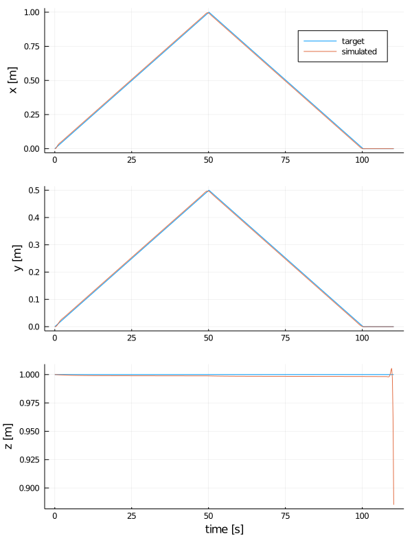
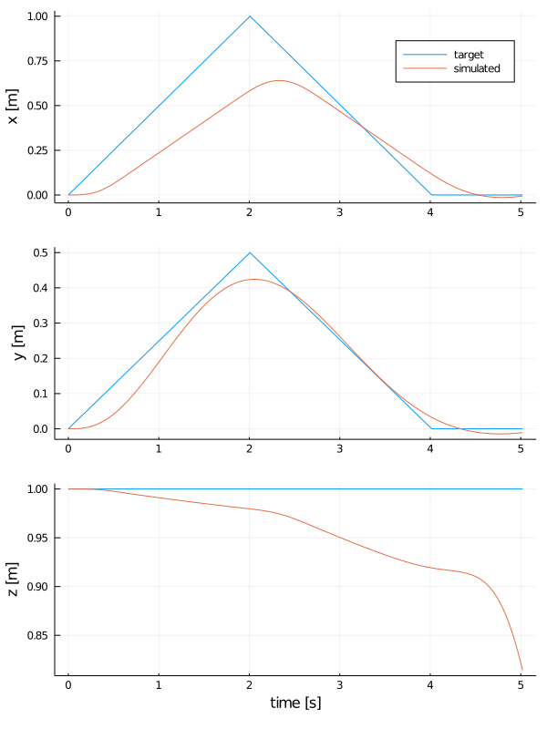
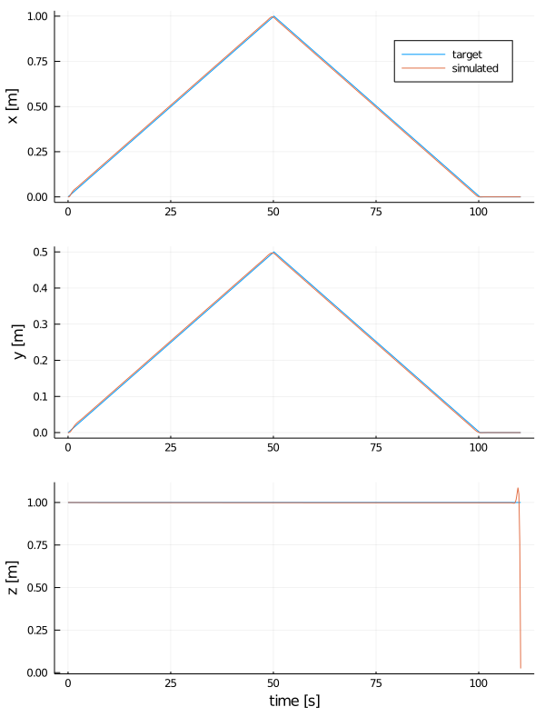
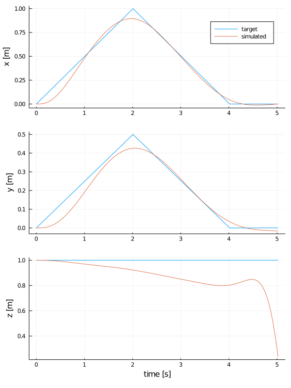

```julia
using Pkg
Pkg.activate(".")
Pkg.instantiate()
```


```julia
include("src/AllAtOnce.jl")
```


    main (generic function with 1 method)


# Résolution avec Ipopt


```julia
# trajectoire à basse vitesse
#
# Les courbes concordent, mais la position en z a un petit "spike" 
# Je ne peux pas l'expliquer

n = 500
pts = [[0.      ,0.     ,1.],
       [1.      ,0.5    ,1.],
       [0.      ,0.     ,1.],
       [0.      ,0.     ,1.]]
t = [0.,50.,100.,110.]

traj = make_linear_trajectory(pts, t, n)
all_at_once_ipopt(traj)
```


    

    


    This is Ipopt version 3.13.4, running with linear solver mumps.
    NOTE: Other linear solvers might be more efficient (see Ipopt documentation).
    
    Number of nonzeros in equality constraint Jacobian...:    17944
    Number of nonzeros in inequality constraint Jacobian.:     4790
    Number of nonzeros in Lagrangian Hessian.............:     5489
    
    Total number of variables............................:     7984
                         variables with only lower bounds:        0
                    variables with lower and upper bounds:        0
                         variables with only upper bounds:        0
    Total number of equality constraints.................:     5988
    Total number of inequality constraints...............:     4790
            inequality constraints with only lower bounds:     2395
       inequality constraints with lower and upper bounds:        0
            inequality constraints with only upper bounds:     2395
    
    iter    objective    inf_pr   inf_du lg(mu)  ||d||  lg(rg) alpha_du alpha_pr  ls
       0  0.0000000e+00 2.16e+00 1.00e+02  -1.0 0.00e+00    -  0.00e+00 0.00e+00   0
       1 -1.2971423e+05 1.50e+00 6.92e+01  -1.0 4.78e+00  -4.0 2.52e-01 3.08e-01f  1
       2 -2.0250954e+05 8.88e-16 1.14e-04  -1.0 3.43e+00  -4.5 1.00e+00 1.00e+00f  1
       3 -2.0251356e+05 8.88e-16 6.58e-07  -1.7 4.85e-02  -5.0 1.00e+00 1.00e+00f  1
       4 -2.0251385e+05 8.88e-16 2.26e-03  -3.8 1.65e-02  -5.4 9.84e-01 1.00e+00f  1
       5 -2.0251385e+05 8.88e-16 5.93e-09  -3.8 3.59e-03  -5.9 1.00e+00 1.00e+00f  1
       6 -2.0251385e+05 8.88e-16 6.04e-11  -5.7 1.02e-04  -6.4 1.00e+00 1.00e+00f  1
       7 -2.0251385e+05 4.44e-16 1.91e-13  -8.6 1.21e-06  -6.9 1.00e+00 1.00e+00f  1
    
    Number of Iterations....: 7
    
                                       (scaled)                 (unscaled)
    Objective...............:  -2.0251384994965818e+04   -2.0251384994965818e+05
    Dual infeasibility......:   1.9139701911715214e-13    1.9139701911715214e-12
    Constraint violation....:   4.4408920985006262e-16    4.4408920985006262e-16
    Complementarity.........:   2.5130943150775651e-09    2.5130943150775650e-08
    Overall NLP error.......:   2.5130943150775651e-09    2.5130943150775650e-08
    
    
    Number of objective function evaluations             = 8
    Number of objective gradient evaluations             = 8
    Number of equality constraint evaluations            = 8
    Number of inequality constraint evaluations          = 8
    Number of equality constraint Jacobian evaluations   = 1
    Number of inequality constraint Jacobian evaluations = 1
    Number of Lagrangian Hessian evaluations             = 1
    Total CPU secs in IPOPT (w/o function evaluations)   =      0.488
    Total CPU secs in NLP function evaluations           =      0.002
    
    EXIT: Optimal Solution Found.


```julia
# trajectoire à haute vitesse
#
# La linéarisation n'est plus adaptée, la solution devient incohérente.

n = 500
pts = [[0.      ,0.     ,1.],
       [1.      ,0.5    ,1.],
       [0.      ,0.     ,1.],
       [0.      ,0.     ,1.]]
t = [0.,2.,4.,5.]

traj = make_linear_trajectory(pts, t, n)
all_at_once_ipopt(traj)
```


    

    


    This is Ipopt version 3.13.4, running with linear solver mumps.
    NOTE: Other linear solvers might be more efficient (see Ipopt documentation).
    
    Number of nonzeros in equality constraint Jacobian...:    17980
    Number of nonzeros in inequality constraint Jacobian.:     4800
    Number of nonzeros in Lagrangian Hessian.............:     5500
    
    Total number of variables............................:     8000
                         variables with only lower bounds:        0
                    variables with lower and upper bounds:        0
                         variables with only upper bounds:        0
    Total number of equality constraints.................:     6000
    Total number of inequality constraints...............:     4800
            inequality constraints with only lower bounds:     2400
       inequality constraints with lower and upper bounds:        0
            inequality constraints with only upper bounds:     2400
    
    iter    objective    inf_pr   inf_du lg(mu)  ||d||  lg(rg) alpha_du alpha_pr  ls
       0  0.0000000e+00 1.00e+00 1.00e+02  -1.0 0.00e+00    -  0.00e+00 0.00e+00   0
       1 -9.1062810e+04 7.98e-01 7.98e+01  -1.0 4.81e+00  -4.0 1.77e-01 2.02e-01f  1
       2 -9.5997084e+04 7.85e-01 7.85e+01  -1.0 3.80e+00  -4.5 5.95e-01 1.61e-02f  1
       3 -1.9592585e+05 4.00e-01 9.46e+01  -1.0 3.90e+00  -5.0 1.00e+00 4.90e-01f  1
       4 -2.1070567e+05 1.41e-01 3.36e+01  -1.0 2.01e+00  -5.4 8.89e-01 6.48e-01f  1
       5 -2.0113215e+05 2.22e-16 1.14e-06  -1.0 7.11e-01  -5.9 1.00e+00 1.00e+00h  1
       6 -2.0124555e+05 2.22e-16 1.52e+00  -1.7 2.16e-01  -6.4 9.64e-01 8.17e-01f  1
       7 -2.0128661e+05 2.22e-16 2.15e-07  -1.7 1.08e-01  -6.9 1.00e+00 1.00e+00f  1
       8 -2.0130984e+05 2.22e-16 9.89e-01  -2.5 1.31e-01  -7.3 7.65e-01 6.79e-01f  1
       9 -2.0132210e+05 2.22e-16 1.67e+01  -2.5 1.46e-01  -7.8 7.46e-01 1.00e+00f  1
    iter    objective    inf_pr   inf_du lg(mu)  ||d||  lg(rg) alpha_du alpha_pr  ls
      10 -2.0132290e+05 2.22e-16 2.85e-08  -2.5 3.50e-02  -8.3 1.00e+00 1.00e+00f  1
      11 -2.0132655e+05 2.22e-16 2.74e+00  -3.8 7.24e-02  -8.8 8.27e-01 6.98e-01f  1
      12 -2.0132771e+05 2.22e-16 3.46e+00  -3.8 4.75e-02  -9.2 1.00e+00 7.10e-01f  1
      13 -2.0132812e+05 2.22e-16 1.07e+00  -3.8 2.21e-02  -9.7 1.00e+00 8.33e-01f  1
      14 -2.0132820e+05 2.22e-16 1.50e-09  -3.8 5.39e-03 -10.2 1.00e+00 1.00e+00f  1
      15 -2.0132838e+05 2.22e-16 1.04e+00  -5.7 1.29e-02 -10.7 9.70e-01 7.05e-01f  1
      16 -2.0132845e+05 2.22e-16 4.72e-01  -5.7 7.50e-03 -11.2 1.00e+00 8.34e-01f  1
      17 -2.0132846e+05 2.22e-16 1.65e-02  -5.7 3.70e-03 -11.6 1.00e+00 9.94e-01f  1
      18 -2.0132846e+05 2.22e-16 1.84e-11  -5.7 1.25e-03 -12.1 1.00e+00 1.00e+00f  1
      19 -2.0132846e+05 2.22e-16 1.16e-01  -8.6 1.10e-03 -12.6 9.98e-01 8.57e-01f  1
    iter    objective    inf_pr   inf_du lg(mu)  ||d||  lg(rg) alpha_du alpha_pr  ls
      20 -2.0132846e+05 2.22e-16 1.10e-01  -8.6 5.83e-04 -13.1 1.00e+00 7.51e-01f  1
      21 -2.0132846e+05 2.22e-16 1.89e-02  -8.6 3.20e-04 -13.5 1.00e+00 9.19e-01f  1
      22 -2.0132846e+05 2.22e-16 1.08e-13  -8.6 1.09e-04 -14.0 1.00e+00 1.00e+00f  1
      23 -2.0132846e+05 2.22e-16 9.46e-14  -9.0 3.98e-05 -14.5 1.00e+00 1.00e+00h  1
    
    Number of Iterations....: 23
    
                                       (scaled)                 (unscaled)
    Objective...............:  -2.0132846352213852e+04   -2.0132846352213851e+05
    Dual infeasibility......:   9.4591001698063337e-14    9.4591001698063337e-13
    Constraint violation....:   2.2204460492503131e-16    2.2204460492503131e-16
    Complementarity.........:   2.9090095273545741e-09    2.9090095273545738e-08
    Overall NLP error.......:   2.9090095273545741e-09    2.9090095273545738e-08
    
    
    Number of objective function evaluations             = 24
    Number of objective gradient evaluations             = 24
    Number of equality constraint evaluations            = 24
    Number of inequality constraint evaluations          = 24
    Number of equality constraint Jacobian evaluations   = 1
    Number of inequality constraint Jacobian evaluations = 1
    Number of Lagrangian Hessian evaluations             = 1
    Total CPU secs in IPOPT (w/o function evaluations)   =      1.203
    Total CPU secs in NLP function evaluations           =      0.007
    
    EXIT: Optimal Solution Found.


# Résolution avec RipQP


```julia
# trajectoire à basse vitesse
#
# Les courbes concordent, mais la position en z a un petit "spike"

n = 500
pts = [[0.      ,0.     ,1.],
       [1.      ,0.5    ,1.],
       [0.      ,0.     ,1.],
       [0.      ,0.     ,1.]]
t = [0.,50.,100.,110.]

traj = make_linear_trajectory(pts, t, n)
all_at_once_RipQP(traj)
```


    

    


```julia
# trajectoire à haute vitesse
#
# La linéarisation n'est plus adaptée, la solution devient incohérente.

n = 500
pts = [[0.      ,0.     ,1.],
       [1.      ,0.5    ,1.],
       [0.      ,0.     ,1.],
       [0.      ,0.     ,1.]]
t = [0.,2.,4.,5.]

traj = make_linear_trajectory(pts, t, n)
all_at_once_RipQP(traj)
```


    

    


```julia

```
