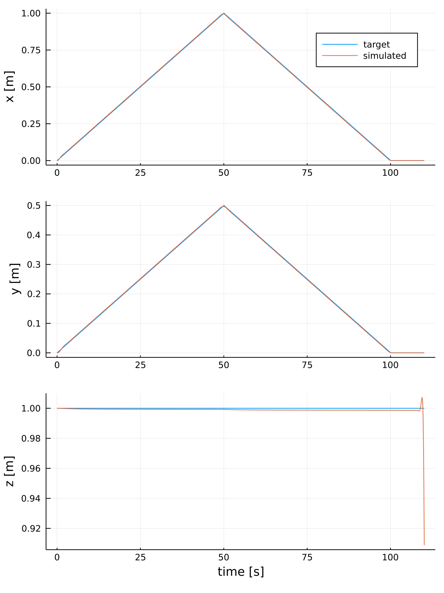

```julia
include("src/AllAtOnce.jl")
```


    all_at_once_ipopt (generic function with 1 method)


# Résolution avec Ipopt


```julia
# trajectoire stationnaire à basse vitesse
#
# Les courbes concordent, mais la position en z a un petit "spike" 
# à la fin que je ne peux pas encore expliquer.

n = 1000
pts = [[0.      ,0.     ,1.],
       [1.      ,0.5    ,1.],
       [0.      ,0.     ,1.],
       [0.      ,0.     ,1.]]
t = [0.,50.,100.,110.]

traj = make_linear_trajectory(pts, t, n)
all_at_once_ipopt(traj)
```


    

    


    
    ******************************************************************************
    This program contains Ipopt, a library for large-scale nonlinear optimization.
     Ipopt is released as open source code under the Eclipse Public License (EPL).
             For more information visit https://github.com/coin-or/Ipopt
    ******************************************************************************
    
    This is Ipopt version 3.13.4, running with linear solver mumps.
    NOTE: Other linear solvers might be more efficient (see Ipopt documentation).
    
    Number of nonzeros in equality constraint Jacobian...:    37942
    Number of nonzeros in inequality constraint Jacobian.:        0
    Number of nonzeros in Lagrangian Hessian.............:    10989
    
    Total number of variables............................:    16983
                         variables with only lower bounds:        0
                    variables with lower and upper bounds:        0
                         variables with only upper bounds:        0
    Total number of equality constraints.................:    12987
    Total number of inequality constraints...............:        0
            inequality constraints with only lower bounds:        0
       inequality constraints with lower and upper bounds:        0
            inequality constraints with only upper bounds:        0
    
    iter    objective    inf_pr   inf_du lg(mu)  ||d||  lg(rg) alpha_du alpha_pr  ls
       0  0.0000000e+00 1.00e+00 1.00e+02  -1.0 0.00e+00    -  0.00e+00 0.00e+00   0
    MUMPS returned INFO(1) = -9 and requires more memory, reallocating.  Attempt 1
      Increasing icntl[13] from 1000 to 2000.
       1 -4.0567186e+05 4.31e-16 4.95e-04  -1.0 4.95e+00  -4.0 1.00e+00 1.00e+00f  1
       2 -4.0567186e+05 3.33e-16 2.29e-09  -5.7 6.88e-05  -4.5 1.00e+00 1.00e+00h  1
    
    Number of Iterations....: 2
    
                                       (scaled)                 (unscaled)
    Objective...............:  -4.0567185859508354e+04   -4.0567185859508353e+05
    Dual infeasibility......:   2.2925313782756751e-09    2.2925313782756751e-08
    Constraint violation....:   3.3306690738754696e-16    3.3306690738754696e-16
    Complementarity.........:   0.0000000000000000e+00    0.0000000000000000e+00
    Overall NLP error.......:   2.2925313782756751e-09    2.2925313782756751e-08
    
    
    Number of objective function evaluations             = 3
    Number of objective gradient evaluations             = 3
    Number of equality constraint evaluations            = 3
    Number of inequality constraint evaluations          = 0
    Number of equality constraint Jacobian evaluations   = 1
    Number of inequality constraint Jacobian evaluations = 0
    Number of Lagrangian Hessian evaluations             = 1
    Total CPU secs in IPOPT (w/o function evaluations)   =      9.675
    Total CPU secs in NLP function evaluations           =      0.463
    
    EXIT: Optimal Solution Found.


```julia
# trajectoire stationnaire à haute vitesse
#
# La linéarisation n'est plus adaptée, la solution devient incohérente.

n = 1000
pts = [[0.      ,0.     ,1.],
       [1.      ,0.5    ,1.],
       [0.      ,0.     ,1.],
       [0.      ,0.     ,1.]]
t = [0.,2.,4.,5.]

traj = make_linear_trajectory(pts, t, n)
all_at_once_ipopt(traj)
```


    

    


    This is Ipopt version 3.13.4, running with linear solver mumps.
    NOTE: Other linear solvers might be more efficient (see Ipopt documentation).
    
    Number of nonzeros in equality constraint Jacobian...:    37980
    Number of nonzeros in inequality constraint Jacobian.:        0
    Number of nonzeros in Lagrangian Hessian.............:    11000
    
    Total number of variables............................:    17000
                         variables with only lower bounds:        0
                    variables with lower and upper bounds:        0
                         variables with only upper bounds:        0
    Total number of equality constraints.................:    13000
    Total number of inequality constraints...............:        0
            inequality constraints with only lower bounds:        0
       inequality constraints with lower and upper bounds:        0
            inequality constraints with only upper bounds:        0
    
    iter    objective    inf_pr   inf_du lg(mu)  ||d||  lg(rg) alpha_du alpha_pr  ls
       0  0.0000000e+00 1.00e+00 1.00e+02  -1.0 0.00e+00    -  0.00e+00 0.00e+00   0
    MUMPS returned INFO(1) = -9 and requires more memory, reallocating.  Attempt 1
      Increasing icntl[13] from 1000 to 2000.
       1 -4.0992273e+05 8.88e-16 4.96e-04  -1.0 4.96e+00  -4.0 1.00e+00 1.00e+00f  1
       2 -4.0992273e+05 4.44e-16 6.65e-08  -5.7 2.00e-03  -4.5 1.00e+00 1.00e+00f  1
       3 -4.0992273e+05 8.88e-16 1.78e-11  -8.6 1.60e-06  -5.0 1.00e+00 1.00e+00h  1
    
    Number of Iterations....: 3
    
                                       (scaled)                 (unscaled)
    Objective...............:  -4.0992273417838296e+04   -4.0992273417838296e+05
    Dual infeasibility......:   1.7797143168785336e-11    1.7797143168785337e-10
    Constraint violation....:   8.8817841970012523e-16    8.8817841970012523e-16
    Complementarity.........:   0.0000000000000000e+00    0.0000000000000000e+00
    Overall NLP error.......:   1.7797143168785336e-11    1.7797143168785337e-10
    
    
    Number of objective function evaluations             = 4
    Number of objective gradient evaluations             = 4
    Number of equality constraint evaluations            = 4
    Number of inequality constraint evaluations          = 0
    Number of equality constraint Jacobian evaluations   = 1
    Number of inequality constraint Jacobian evaluations = 0
    Number of Lagrangian Hessian evaluations             = 1
    Total CPU secs in IPOPT (w/o function evaluations)   =     10.873
    Total CPU secs in NLP function evaluations           =      0.018
    
    EXIT: Optimal Solution Found.

